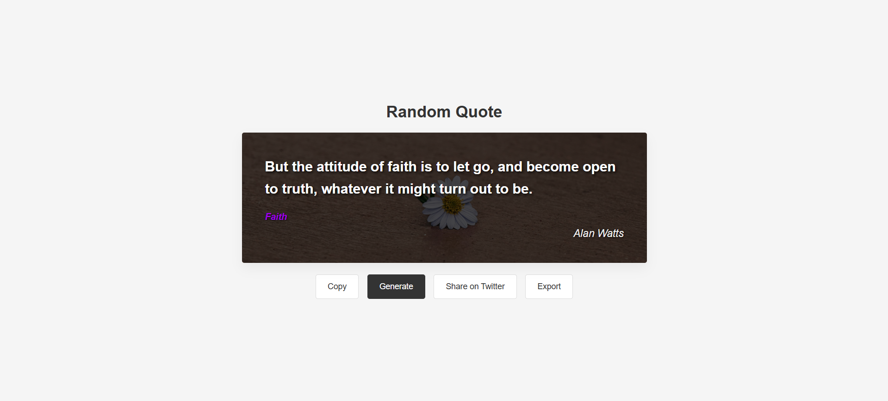
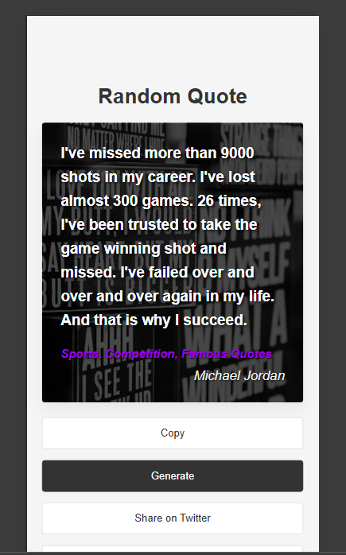
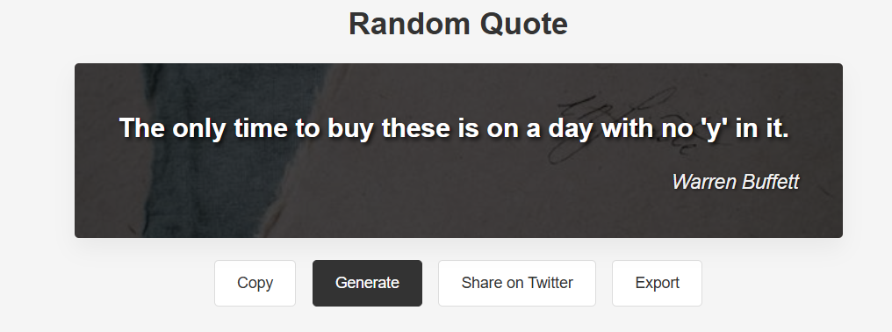

# Quote Generator

A sleek, modern web application that generates random inspirational quotes with beautiful background images. Perfect for finding daily motivation or sharing wisdom on social media.


## Features

- **Random Quote Generation**: Get a fresh inspirational quote with each click
- **Dynamic Backgrounds**: Each quote appears on a randomly selected beautiful background image
- **Author Attribution**: See who said each profound quote
- **Tag Categories**: Browse quotes by their thematic tags
- **Responsive Design**: Works perfectly on both desktop and mobile devices
- **Easy Sharing**: Share your favorite quotes directly to Twitter
- **Copy Functionality**: One-click copying of quotes to your clipboard
- **Image Export**: Download the background images for personal use
- **Throttled API Calls**: Performance optimization to prevent excessive API requests

## Screenshots

### Desktop View


### Mobile View


### Dark Overlay for Readability


## How It Works

1. Click the "Generate" button to fetch a new random quote
2. Read the inspirational content with its author and category tags
3. Use the "Copy" button to copy the quote text to your clipboard
4. Share directly to Twitter with the "Share on Twitter" button
5. Download the background image with the "Export" button

## Technical Implementation

- **API Integration**: Fetches random quotes from the freeapi.app public quotes API
- **Dynamic Styling**: CSS designed for optimal readability against any background
- **Error Handling**: Graceful error management for API failures
- **Performance Optimization**: Implements throttling to prevent API abuse
- **Cross-platform Compatibility**: Works across all modern browsers

## Deployment

Live Demo: [Quote Generator App](https://random-quote-generator-ecru-nine.vercel.app/)

## Local Installation

1. Clone the repository:
   ```
   git clone https://github.com/Tejas-Dherange/random-quote-generator.git
   ```

2. Navigate to the project directory:
   ```
   cd random-quote-generator
   ```

3. Open the `index.html` file in your browser or use a local server:
   ```
   npx serve
   ```

## Future Enhancements

- User accounts to save favorite quotes
- Custom background upload option
- Quote filtering by author or category
- Dark/light mode toggle
- Additional export formats (PDF, image with quote)

## Credits

- Images from [Pexels](https://www.pexels.com/)
- Quotes API by [FreeAPI.app](https://freeapi.app)